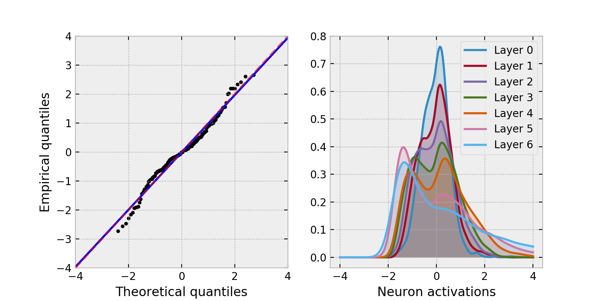

### Self-Normalizing Neural Networks

---

Implementation of SNNs [1] in PyTorch. 

SNNs keep the neuron activations in the network near zero mean and unit variance, by employing the following tools.

1. SELU activation

2. Initialization of weights

3. Alpha-dropout (though dropout is rarely necessary in my experience)

4. Scale input features to zero-mean, unit variance.

Constants are chosen appropriately to be:

Note that I found Adamax to have best empirical performance when optimizing.

#### Usage

See the `examples/` folder for examples. Below we show a regression task with an 8-layer SNN for the concrete compression dataset [2]. The left pane shows the regression QQ-plot and the right pane shows the (roughly standard normally distributed) activations of the layers in the network. 

#### References

[1] G. Klambauer, T. Unterthiner, A. Mayr, & S. Hochreiter, Self-Normalizing Neural Networks. In I. Guyon, U.V. Luxburg, S. Bengio, H. Wallach, R. Fergus, S. Vishwanathan, & R. Garnett,eds., Advances in Neural Information Processing Systems 30 (Curran Associates, Inc., 2017), pp. 971–980.

[2] I. Yeh, Modeling of strength of high performance concrete using artificial neural networks. In Cement and Concrete Research, Vol. 28, No. 12, pp. 1797-1808 (1998). 

#### License

This code is available under the MIT License.
